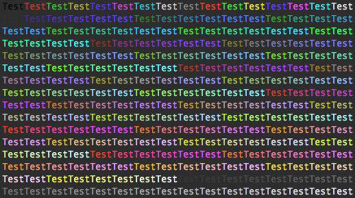

# FreqUsedCustomCmds
freq used custom commands in linux/unix

##ls-custom.sh
- import content of the file into `.bashrc` or `.bash_profile` with
```bash
if [-f ~/Bin/ls-custom.sh ];then
	. ~/Bin/ls-custom.sh
fi
# This works with any OS with bash
```
- lz will get stuck in some dir, reasons may be,
 - the dir contains too many files
 - the dir contains huges files in size


## colors-8.sh
- contains only 8 colors: `black`(0), `red`(1), `green`(2), `yellow`(3), `blue`(4), `fuchsia`(5), `ultramarine`(6), `white`(7)
- basic style: `bold`(01), `underline`(04), `dim`(02), `reverse`(07), `blink`(05)
- `b_*` for bold, `d_*` for dim, `i_*` for blink, `v_*` for reverse
- `underline` is not added as a group due to its infrequentness
- The color motif is `\033[<0?[0124578];><[34][012345679]>m`
 - the part before `;` is for *basic style* setting with leading zero
 - the part before `m`  and after `;` is for color
		*  background color is given with a leading **4**
		*  foreground color is given with a leading **3**  
- The variables can be nested to function both styles, `$bold$red` equals to `$b_red`
- `$endc` should be used whenever you want to end the style rendering 
## colors-256.sh
- The `38` and `48` are reserved for Terminal supporting `256-color`
- You can see the resultant effect with code below:
```bash
n=0
for num in `seq 000 255`;do
	if [ $(( $(($n + 1)) % 16 )) -eq 0 ];then
		echo -e "\033[38;05;${num}mTest\033[00m"
	else
		echo -en "\033[38;05;${num}mTest\033[00m"
	fi
	n=$(($n + 1))
done
# foreground
```

```bash
n=0; for num in `seq 000 255`;do if [ $(( $(($n + 1)) % 16 )) -eq 0 ];then echo -e "\033[48;05;${num}mTest\033[00m"; else echo -en "\033[48;05;${num}mTest\033[00m"; fi; n=$(($n + 1)); done
#background
```
