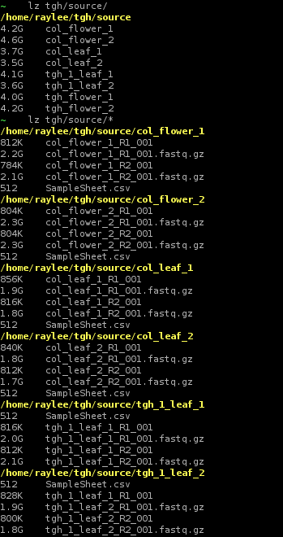
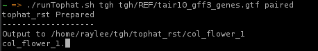

## runTophat.sh
- a wrapper for tophat2
- `paired` requires that `source` dir contains subdirs
  - each subdir contains replicates of one sample
  - the subdirs' name will be used as the name for processing
**Note: The `basedir` is the parent dir of source, and should not include `source`**
```text
usage: ./runTophat.sh basedir gft_file_path paired/single
---------
 basedir is the parent dir where all the fastq file are stored
 All the fastq files should be put into a dir named source
---------
basedir|
       |-source
       |-tophat_rst
       |-cuff_rst|
                 |-cufflinks
                 |-cuffmerge
                 |-cuffdiff
```
for example,
if the source dir is at `/home/raylee/tgh/source`, and it's `paired`, and `runTophat.sh` is at `/home/raylee`, then
```bash
./runTophat.sh tgh tgh/REF/tair10_gff3_genes.gtf paired
```

