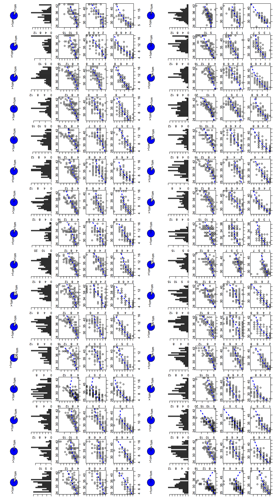

## F2 generation flowering time and fertility stat.
> F2 of hen1-2 (early flowering) x hen1-8 (late flowering). both mutants have severe fertility defects.
- 总共32盘
- 每盘播种120株，但实际的发芽率和环境因素的影响，没有一盘是完整的
- 最后只统计了3364株的相关参数，最后仍然有67株没有统计

- f2_gen_5.11.csv
	- `pan` 所在盘的数字编号
	- `name` 每株植物的编号，唯一性
	- `date` 主颈2cm时的日期，没有标明月份
	- `rosette` 莲座叶
	- `cauline` 分支叶
	- `days` 主颈2cm距播种日期的时间(天数)
	- 
- calculation.R
	- 为每一盘都做一组统计图表，包括barplot, pie plot, statter plot
	- barlpot 横坐标为天数，纵坐标为该天符合条件的植株数
	- 每组有5张图
		- 第一张为统计的进度
		- 第二张为天数和植株数的关系，可以看出是否为数量性状
		- 第三张为
	- 结果图为

